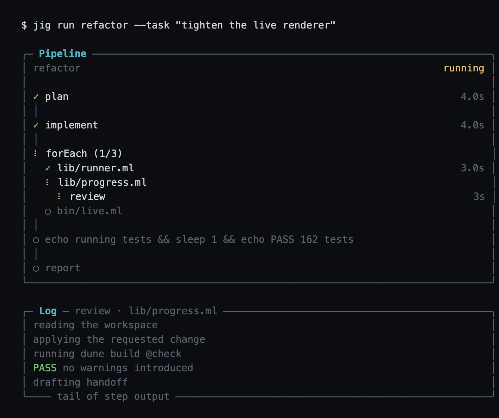

# jig

A minimal, agnostic runner for AI-driven development workflows.
Declarative workflow format + portable runner with four swappable ports - the primitive, not the product.

jig does not implement an agent. Each step of a workflow is a headless
invocation of the agent harness you already use (`claude -p`, `codex exec`,
any CLI that takes a prompt); jig owns the ordering, the retries, the
escalation to humans, the run history, and the cost log.

## Quickstart

1. Download a binary from the releases page (or `dune build` from source).
2. In your repository:

   ```sh
   jig init --harness claude --skill-paths ~/.claude/skills
   ```

   Scaffolds `.jig/` from the set embedded in the binary: two reference
   workflows (`bugfix`, `feature-development`), their skills, and a working
   harness preset (`claude` or `codex`; bare `jig init` writes a commented
   template). `--skill-paths` points workflows at an existing skill
   library.

3. Point `.jig/config.yaml` at your harness, then:

   ```sh
   jig validate bugfix
   jig run bugfix --task "users can't reset their password when ..."
   jig status <run-id>
   ```

A run walks the workflow step by step. Each step's agent ends with a
**handoff** - status plus a note for the next agent - and jig threads it
into the next step's prompt. Failed steps inside a `retry` block loop with
their failure notes until the tests pass or the budget exhausts; anything
marked `escalate` pauses the run for you:

```sh
jig run --resume <run-id> --guidance "the fix belongs in the parser, not the lexer"
```

## The live view

On a TTY, `jig run` draws the run in place: the pipeline with a spinner on
the active step and per-step durations and costs, and beneath it a live
tail of what the running step's agent is doing.
When the run ends, the completed pipeline stays in the scrollback above the
run report; each step's full output lives in the run record.



## The verbs

```
jig init                                    # scaffold .jig/ from the embedded starter set
jig run <workflow> --task "<description>"   # execute a workflow against a task
  [--isolated]                              #   in a git worktree per run
  [--detach]                                #   survives its terminal; steps stream to runs/<run-id>.log
jig run --resume <run-id> [--guidance "…"]  # continue a paused run
  [--skip]                                  #   a human finished the paused step; record it and move on
jig attach <run-id>                         # open the paused step's session; exiting the chat hands back
jig status <run-id> [--json]                # inspect a run
jig list workflows|runs [--json]            # discover what is runnable, and what ran
jig validate <workflow>                     # lint before running
```

## Layout

```
.jig/
  config.yaml          # harness command (+ optional sandbox wrapper)
  skills/<name>/SKILL.md
  workflows/<name>.yaml
  runs/                # one JSON record per run + metering.jsonl
```

Everything is a file: skills and workflows are versioned with the code they
operate on, run records are plain JSON a GUI could be built against, and the
binary has no other state.

## Where jig fits

Most ways to run a multi-step agent task keep the plan inside the harness:
the model picks the next step turn by turn, or a harness-native script
orchestrates workers in-process. jig moves the plan out of the harness and
into a file.

|                     | Prompt the agent      | Harness-native orchestration | jig                                   |
| :------------------ | :-------------------- | :--------------------------- | :------------------------------------ |
| Who holds the plan  | the model, turn by turn | the harness              | files you own                         |
| What runs a step    | the agent             | one or more agents, in-process | any agent CLI, as a subprocess    |
| Where run state lives | the context window  | harness memory, session-scoped | files on disk                       |
| Human mid-run       | reprompt and retry    | not until it returns         | pauses for a human, then resumes      |
| Repeatable artifact | none                  | a script tied to one harness | a workflow file you can commit and reuse |

The trade: jig gives up in-process speed and large parallel fan-out for a
portable definition, durable run history, and a human-in-the-loop pause that
survives the terminal.

## The harness skill

[`skills/jig/`](skills/jig/SKILL.md) teaches an agent harness to operate the binary instead of you typing the verbs.
Install by copying it where your harness discovers skills - for Claude Code:

```sh
mkdir -p ~/.claude/skills && cp -R skills/jig ~/.claude/skills/          # every project
mkdir -p <repo>/.claude/skills && cp -R skills/jig <repo>/.claude/skills/   # one project
```

The skill turns a ticket into a supervised run: condense the ticket into a task, validate, launch with `--detach`, poll `jig status --json`, triage pauses (answer derivable questions itself, surface the rest verbatim), and report the outcome with cost and artifacts.
It never executes a workflow's YAML by hand - the run record, metering, and resume semantics exist only through the binary.

## Docs

- [Writing a skill](docs/writing-a-skill.md)
- [Writing a workflow](docs/writing-a-workflow.md)
- [Implementing a port](docs/implementing-a-port.md)

## Design

Four ports (Executor, ModelProvider, Metering, Store) behind module
signatures with boring local defaults: subprocess, config lookup, JSONL,
filesystem. Isolation is Executor configuration (`--isolated` runs in a git
worktree per run; an optional config `wrapper` prepends an OS sandbox to
every invocation). The workflow schema is deliberately frozen at ordered
steps + `on_fail` + bounded `retry`, extended by recorded decision with
`context:` (constant per-workflow framing), `with:` (literal step inputs),
and `forEach:` (bounded fan-out over a checked-in items file) - data
binding, not control flow; intelligence lives in skills, not in YAML.
